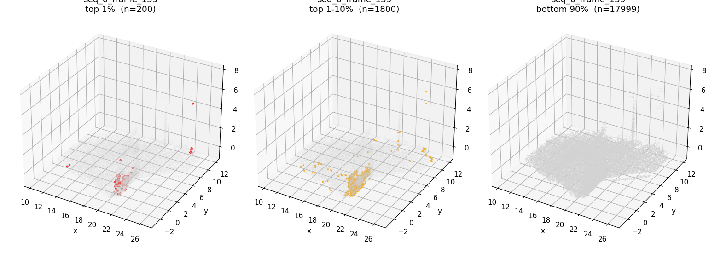
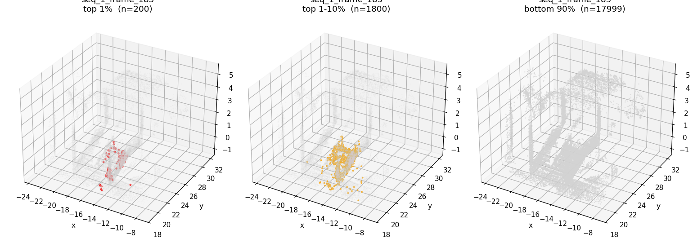
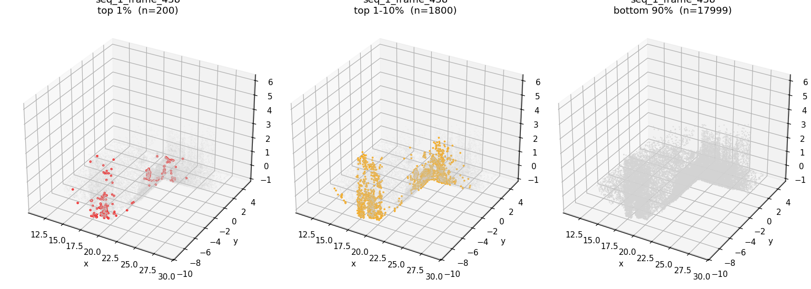
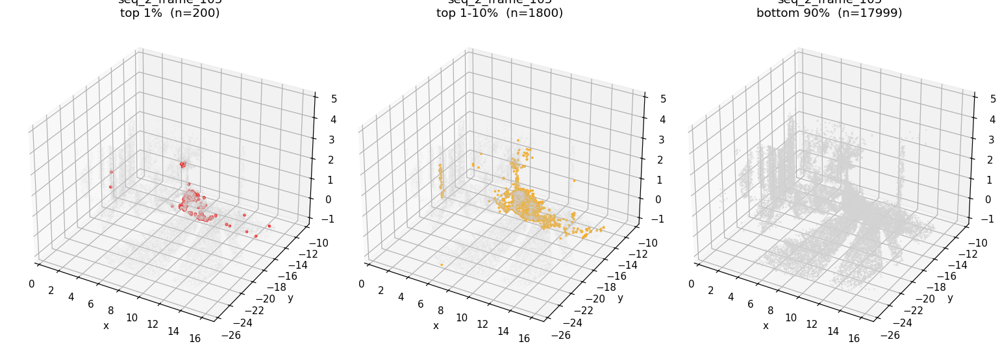
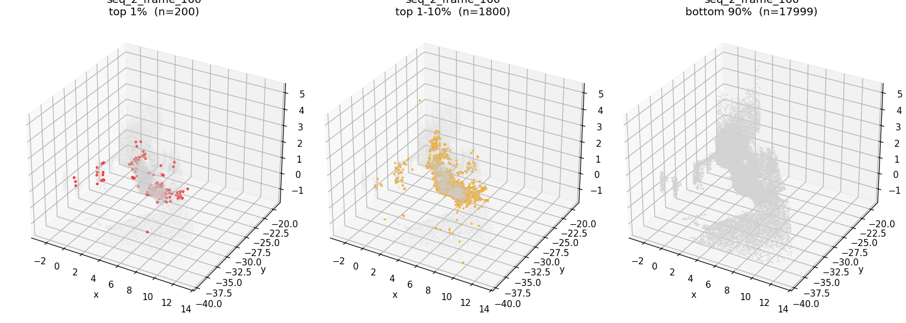
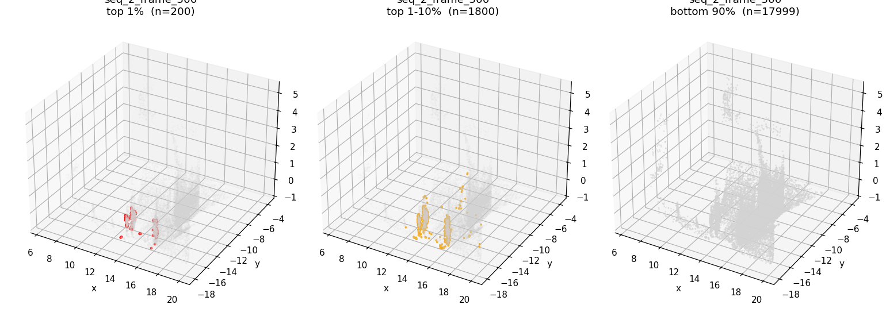

# Phase A — Fisher imbalance diagnostic

Reads `fisher_diagnostic.pt` from each scene's v5_v4 default (combo_jitter recipe) output dir. Each row = one scene. Each column = the cumulative fraction of total ‖∇p L‖ held by the top-k% of points.

## Career accumulator (entire training run)

| scene | top 0.1% | top 0.5% | top 1% | top 5% | top 10% | top 25% | top 50% | test cc |
|---|---|---|---|---|---|---|---|---|
| seq_0_frame_135 | 7.7% | 17.2% | 24.7% | 54.7% | 72.7% | 94.0% | 99.4% | 0.5747 |
| seq_1_frame_185 | 4.1% | 11.2% | 17.0% | 40.6% | 56.6% | 81.4% | 96.5% | 0.5413 |
| seq_1_frame_438 | 3.5% | 10.6% | 16.2% | 38.6% | 53.7% | 77.4% | 93.5% | 0.6693 |
| seq_2_frame_105 | 6.2% | 15.4% | 22.6% | 49.5% | 65.8% | 88.7% | 98.6% | 0.5572 |
| seq_2_frame_160 | 3.0% | 8.7% | 13.5% | 35.4% | 50.3% | 74.5% | 92.0% | 0.6318 |
| seq_2_frame_300 | 12.7% | 24.1% | 31.9% | 60.3% | 76.2% | 93.7% | 98.8% | 0.4525 |
| **mean** | **6.2%** | **14.5%** | **21.0%** | **46.5%** | **62.6%** | **84.9%** | **96.5%** | **0.5711** |

## Last densify window only (iter 400–500)

| scene | top 0.1% | top 0.5% | top 1% | top 5% | top 10% | top 25% | top 50% |
|---|---|---|---|---|---|---|---|
| seq_0_frame_135 | 7.2% | 16.5% | 24.2% | 58.1% | 79.3% | 97.3% | 99.8% |
| seq_1_frame_185 | 5.8% | 13.0% | 18.8% | 44.7% | 62.5% | 87.1% | 98.1% |
| seq_1_frame_438 | 5.0% | 14.1% | 20.7% | 46.9% | 63.2% | 84.8% | 96.4% |
| seq_2_frame_105 | 5.2% | 13.9% | 20.9% | 50.5% | 70.2% | 93.5% | 99.4% |
| seq_2_frame_160 | 4.9% | 11.8% | 17.4% | 42.6% | 59.7% | 83.8% | 96.3% |
| seq_2_frame_300 | 11.5% | 24.4% | 32.9% | 63.8% | 81.4% | 97.3% | 99.6% |
| **mean** | **6.6%** | **15.6%** | **22.5%** | **51.1%** | **69.4%** | **90.6%** | **98.3%** |

## Per-densify snapshot (each scene × each densify event = one row)

| scene | iter | top 0.5% | top 1% | top 5% | top 10% | top 25% | top 50% |
|---|---:|---:|---:|---:|---:|---:|---:|
| seq_0_frame_135 | 100 | 31.8% | 44.4% | 77.8% | 88.8% | 97.2% | 99.6% |
| seq_0_frame_135 | 200 | 26.4% | 38.8% | 76.1% | 89.5% | 98.1% | 99.8% |
| seq_0_frame_135 | 300 | 24.2% | 34.2% | 71.9% | 87.9% | 98.0% | 99.8% |
| seq_0_frame_135 | 400 | 20.3% | 28.5% | 64.1% | 83.7% | 97.7% | 99.8% |
| seq_1_frame_185 | 100 | 22.5% | 32.4% | 62.6% | 77.2% | 93.0% | 99.1% |
| seq_1_frame_185 | 200 | 15.7% | 23.4% | 53.4% | 70.4% | 90.8% | 98.8% |
| seq_1_frame_185 | 300 | 16.1% | 23.3% | 52.0% | 69.2% | 90.3% | 98.7% |
| seq_1_frame_185 | 400 | 14.8% | 22.0% | 49.9% | 67.3% | 89.5% | 98.5% |
| seq_1_frame_438 | 100 | 11.8% | 19.1% | 47.7% | 64.0% | 85.1% | 96.3% |
| seq_1_frame_438 | 200 | 15.0% | 22.9% | 51.6% | 67.6% | 88.1% | 97.8% |
| seq_1_frame_438 | 300 | 16.9% | 24.2% | 50.6% | 66.1% | 86.5% | 97.2% |
| seq_1_frame_438 | 400 | 17.7% | 24.9% | 49.9% | 64.9% | 85.5% | 96.7% |
| seq_2_frame_105 | 100 | 25.2% | 35.7% | 67.5% | 81.1% | 95.0% | 99.3% |
| seq_2_frame_105 | 200 | 25.5% | 35.5% | 68.3% | 83.1% | 96.3% | 99.6% |
| seq_2_frame_105 | 300 | 21.9% | 30.4% | 62.5% | 79.8% | 95.7% | 99.6% |
| seq_2_frame_105 | 400 | 17.1% | 25.0% | 56.8% | 75.5% | 94.8% | 99.5% |
| seq_2_frame_160 | 100 | 11.7% | 18.4% | 45.7% | 61.9% | 83.3% | 95.5% |
| seq_2_frame_160 | 200 | 11.4% | 17.9% | 45.2% | 62.2% | 84.8% | 96.6% |
| seq_2_frame_160 | 300 | 11.5% | 17.5% | 43.3% | 60.2% | 83.6% | 96.3% |
| seq_2_frame_160 | 400 | 11.3% | 17.0% | 42.5% | 59.3% | 83.0% | 96.2% |
| seq_2_frame_300 | 100 | 37.0% | 48.0% | 75.4% | 84.7% | 94.9% | 99.2% |
| seq_2_frame_300 | 200 | 37.8% | 49.4% | 81.6% | 90.9% | 97.4% | 99.6% |
| seq_2_frame_300 | 300 | 33.1% | 43.2% | 76.6% | 89.9% | 97.6% | 99.6% |
| seq_2_frame_300 | 400 | 27.6% | 36.9% | 70.1% | 86.7% | 97.8% | 99.6% |

## 3D scatter plots

(One PNG per scene, three panels: top 1% / top 1-10% / bottom 90% in 3D space.)

